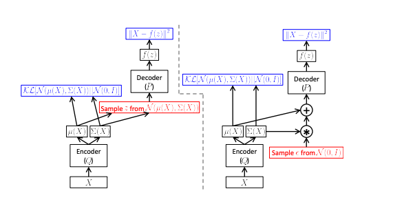

# Variational AutoEncoders

Notes from various papers

## Objective

Genrative modeling using latent variables, with a mapping parametrized by $ \theta $ is 

>   $ P(X) = {\int P(X|z; θ)P(z)dz} $ &nbsp;&nbsp;&nbsp;(1)  

## VAE Approach  

The challenge in equation 1 is defining the latent variable z and how to deal with integral over z. 
VAEs donot assert any structure to z, instead they assume z can be drawn from a $ \mathcal{N}(0, I) $  
The key is to notice that any distribution in d dimensions can be generated by taking a set of d  
variables that are normally distributed and mapping them through a sufficiently complicated function

 This reduces 

>  (2)  $ P(X|z) $ to $ \mathcal{N} (X|f(z;\theta),\sigma^2 * I) $  &nbsp;&nbsp;&nbsp;(2)

This leaves finding P(z). In practice, for most z, P(X|z) will be nearly zero, and hence contribute  
almost nothing to our estimate of P(X). The key idea behind the variational autoencoder is to attempt  
to sample values of z that are likely to have produced X, and compute P(X) just from those. This means  
that we need a new function Q(z|X) which can take a value of X and give us a distribution over z values  
that are likely to produce X. Hopefully the space of z values that are likely under Q will be much  
smaller than the space of all z’s that are likely under the prior P(z) 

> $ D [Q(z) || P(z|X)] = E_{z∼Q} [log Q(z) − log P(z|X)] $ &nbsp;&nbsp;&nbsp;(3)

Applying Bayes rule and moving things around we get

> $ log P(X) − D [Q(z)||P(z|X)] = E_{z∼Q} [log P(X|z)] − D [Q(z) || P(z)]  $ &nbsp;&nbsp;&nbsp;(4)

We can construct a Q that does depend on X, althought above does not require it to be. This is desirable 
since we are trying to maximize log P(X). This give us

> $ log P(X) − D [Q(z|X) || P(z|X)] = E_{z∼Q} [log P(X|z)] − D [Q(z|X) || P(z)]  $  &nbsp;&nbsp;&nbsp;(5)

> Now the right handside has taken the form of an autoencoder. We are trying to encode X into z and P is 
> decoding it to reconstruct X

- The second term on the left is trying to move Q(z|X) closer to P(z|X). With arbitarily powerful models we hope 
  that should be possible. This will cause the divergence term to be 0
- To perform stochastic gradient descent on the right handside we assume Q(z|X) to be of the form  
  $ \mathcal{N} (z|\mu(X;\theta),\sigma(Z;\theta)) $. The $ \sigma $ is also constrained to be diagonal 

## Setting up Objective

To take a gradient of (5) makes the loss computation equivalent to 
> $ log P(X|z) − D [Q(z|X)||P(z)] $

However this depends not only on P but also on parameters of Q. We have to drive Q to produce codes for X, that P 
can reliably use to reconstruct X. Seen differently, the forward pass works as shown on the left handside below 
However we need to backpropogate the error through a layer that samples z from Q(z|X), which is a non continuous 
operation and has no gradient.

**Stochastic gradient descent can handle stochastic inputs but not stochastic units in the network**

The solution is called **reparametrization trick** to move sampling to an input layer. 
Given $\mu(X)$ and $\Sigma(X)$ the mean and covariance, we can sample from $\mathcal{N}(\mu(X),\Sigma(X))$ by first 
sampling $\epsilon$ from $\mathcal{N}(0,1)$, then computing z = $\mu(X) + \Sigma(X)*\epsilon$. Thus the equation 
we are actually taking gradient of becomes

> $E_{X∼D}[ E_{\mathcal{N}(0,1)}[logP(X|z = \mu(X) + \Sigma^{1/2}(X)*\epsilon)] - D[Q(z|X)||P(z)]]$

This is shown in figure below on the RHS

   [

